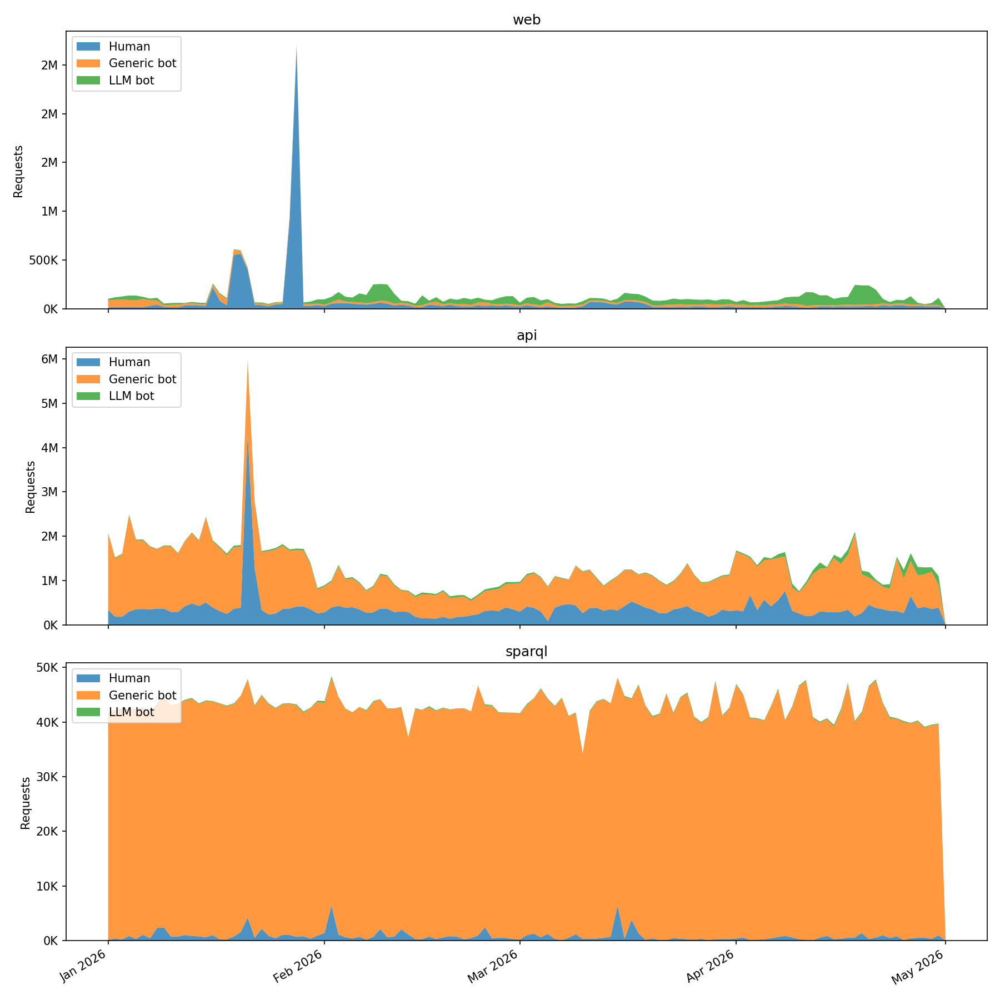
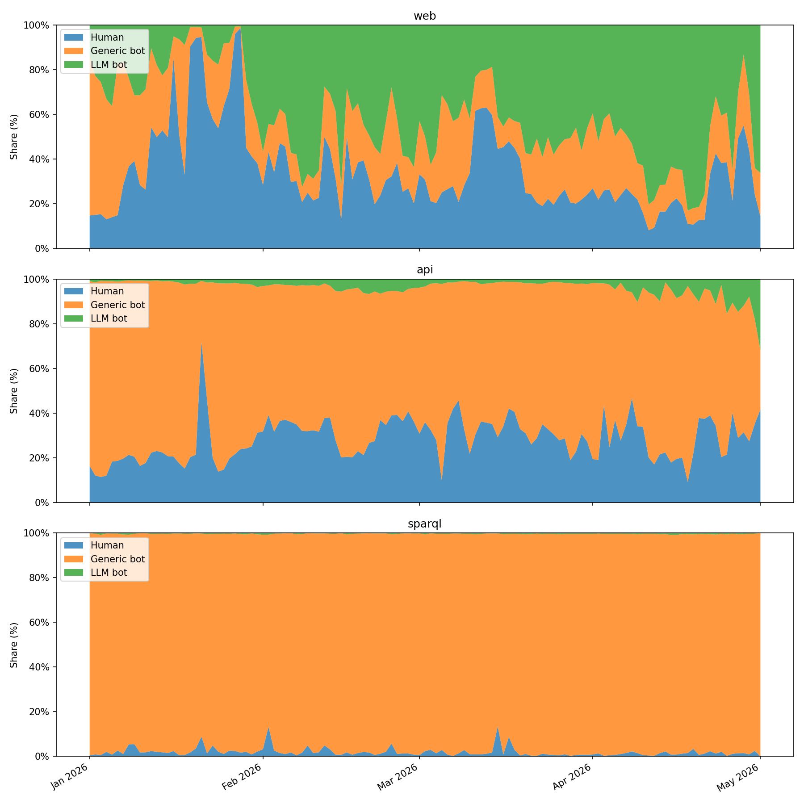

# oc-botwatch

[](https://github.com/arcangelo7/oc-botwatch/actions/workflows/test.yml)
[](https://arcangelo7.github.io/oc-botwatch/coverage/)

Classifies traffic from [OpenCitations](https://opencitations.net) server access logs into three categories (human visitors, generic bots, LLM bots) and three services (web, API, SPARQL).

It reads monthly CSV dumps, looks at each request's user-agent, host, and path, and outputs `daily_traffic.csv` with per-day totals by category plus `daily_traffic_by_service.csv` with the same counts broken down by service.

## Input data

The script reads all `.csv` files from the `input/` directory. Each file is a monthly export of OpenCitations HTTP access logs; the `date`, `user_agent`, `request_host`, and `request_path` columns are used. The datasets are not yet publicly available but will be released in the future.

## How classification works

The rule we follow is simple: a request only counts as a bot when its user-agent identifies it as one of the well-known crawlers. Nothing else. We match the user-agent against three public lists, included as git submodules:

- [ai.robots.txt](https://github.com/ai-robots-txt/ai.robots.txt)
- [crawler-user-agents](https://github.com/monperrus/crawler-user-agents)
- [COUNTER-Robots](https://github.com/atmire/COUNTER-Robots)

If the user-agent matches an entry in ai.robots.txt, the request is an `llm_bot`. The two names "Spider" and "Code" are skipped because they're too generic and would match strings that have nothing to do with LLM crawlers. If instead it matches crawler-user-agents (minus the entries already tagged `ai-crawler`) or COUNTER-Robots, it's a `generic_bot`. A handful of crawlers turn up in our logs but aren't in any of those three lists, so we keep an extra file for them:

- [`supplementary_bots.txt`](supplementary_bots.txt)

Everything else is `human`. That covers the obvious case of a person browsing the site, but it also covers the less obvious cases on purpose: somebody hitting our API from a Python script, a curl command in a shell loop, a researcher pulling data with a homemade scraper. None of those count as bots here.

### Why these three sources

Because they have already been adopted in the literature. In particular, [Liu et al. (2025)](https://doi.org/10.1145/3730567.3732913) uses Dark Visitors, the upstream data source of ai.robots.txt, as its primary reference for compiling LLM user agents, and relies on crawler-user-agents as a supplementary corpus of general-purpose bot signatures when testing the coverage of Cloudflare's bot-blocking feature. 

COUNTER-Robots is the robot list maintained by [Project COUNTER](https://www.projectcounter.org), an international initiative that sets standards for counting usage of electronic scholarly resources. Since OpenCitations is itself a scholarly infrastructure, filtering its logs with COUNTER-Robots aligns with the conventions of the domain.

## Service classification

Each request is also assigned to one of three services, based on `request_host` and `request_path`:

- `sparql`: host `sparql.opencitations.net`, or any path matching `/sparql` (covers `opencitations.net/sparql`, `opencitations.net/index/sparql`, `opencitations.net/index/coci/sparql`).
- `api`: host `api.opencitations.net`, or any path under a versioned API route: `/index/v\d+/`, `/index/api/v\d+/`, `/index/coci/api/v\d+/`, `/meta/v\d+/`, `/meta/api/v\d+/`. The INDEX, COCI, and META REST endpoints are grouped together under `api`.
- `web`: everything else. This bucket holds the main site (`opencitations.net/`, `/about`, `/governance`, ...) along with smaller subdomains such as `ldd.opencitations.net`, `search.opencitations.net`, `download.opencitations.net`, `statistics.opencitations.net`, `oci.opencitations.net`, and `sparontologies.net`.

The SPARQL rule is evaluated before the API one because `opencitations.net/index/sparql` would otherwise be captured by the versioned API pattern.

## Findings

The dataset covers January through April 2026. The `output/` directory contains `daily_traffic.csv` (per-day counts by category), `daily_traffic_by_service.csv` (per-day counts by category and service), and four stacked area charts.

```csv
date,human,generic_bot,llm_bot
2026-01-01,353575,1831164,33985
2026-01-02,201801,1431714,49966
...
```


Across the entire period, human traffic accounts for 26% to 31% of monthly requests. Generic bots range from 59% to 67%. LLM bots started at 2% in January and reached 11% in April, growing from 1.34M to 4.92M monthly requests (+267%).

### By service

```csv
date,category,service,count
2026-01-01,generic_bot,api,1716034
2026-01-01,human,api,338129
2026-01-01,llm_bot,api,19233
...
```





Across the four months, the REST API takes 87.3% of all traffic (159.1M requests), the web bucket 9.8% (17.9M), and SPARQL 2.8% (5.15M). The audience mix differs sharply by service:

| Service | Human | Generic bot | LLM bot |
|---|---|---|---|
| web | 49.9% | 16.6% | 33.6% |
| api | 28.4% | 68.5% | 3.1% |
| sparql | 1.9% | 97.7% | 0.3% |

LLM bots concentrate on web pages, where they account for one third of the traffic; they barely touch SPARQL. The API is the workhorse for generic crawlers. SPARQL has a near-flat daily rate dominated by a small set of generic bots, suggesting scheduled scrapers rather than interactive querying.

## Limitations

We only catch bots that openly identify themselves through the user-agent. Anything that spoofs a browser string, or uses a custom user-agent that doesn't appear in the three lists, is going to land in the human bucket. So in practice the bot counts are a lower bound and the human counts an upper bound. The numbers still work well for tracking how the relative shares move over time, since the same rules are applied across the whole dataset.

## Running

Requires Python 3.10+ and [uv](https://docs.astral.sh/uv/).

```
uv sync
uv run python -m oc_botwatch.classify
uv run python -m oc_botwatch.visualize
```

## Tests

```
uv sync --dev
uv run pytest
```

