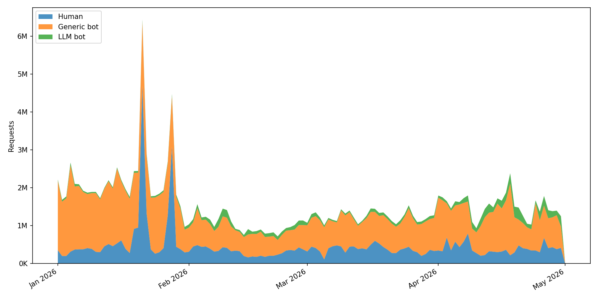
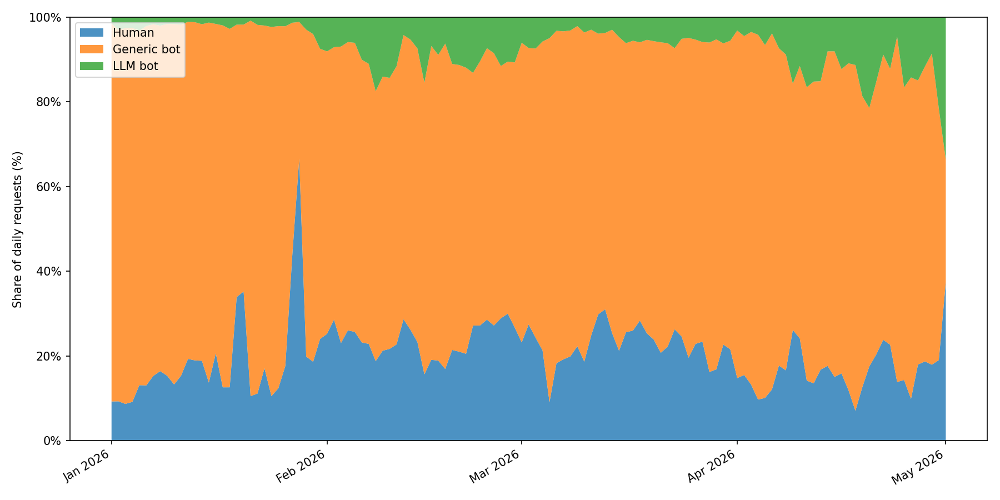

# oc-botwatch

[](https://github.com/arcangelo7/oc-botwatch/actions/workflows/test.yml)
[](https://arcangelo7.github.io/oc-botwatch/coverage/)

Classifies traffic from [OpenCitations](https://opencitations.net) server access logs into three categories: human visitors, generic bots, and LLM bots.

It reads monthly CSV dumps, looks at each request's user-agent string, and outputs a single `daily_traffic.csv` with per-day counts for each category.

## Input data

The script reads all `.csv` files from the `input/` directory. Each file is a monthly export of OpenCitations HTTP access logs; only the `user_agent` and `date` columns are used. The datasets are not yet publicly available but will be released in the future.

## How classification works

The rule we follow is simple: a request only counts as a bot when its user-agent identifies it as one of the well-known crawlers. Nothing else. We match the user-agent against three public lists, included as git submodules:

- [ai.robots.txt](https://github.com/ai-robots-txt/ai.robots.txt)
- [crawler-user-agents](https://github.com/monperrus/crawler-user-agents)
- [COUNTER-Robots](https://github.com/atmire/COUNTER-Robots)

If the user-agent matches an entry in ai.robots.txt, the request is an `llm_bot`. The two names "Spider" and "Code" are skipped because they're too generic and would match strings that have nothing to do with LLM crawlers. If instead it matches crawler-user-agents (minus the entries already tagged `ai-crawler`) or COUNTER-Robots, it's a `generic_bot`. A handful of crawlers turn up in our logs but aren't in any of those three lists, so we keep an extra file for them:

- [`supplementary_bots.txt`](supplementary_bots.txt)

Everything else is `human`. That covers the obvious case of a person browsing the site, but it also covers the less obvious cases on purpose: somebody hitting our API from a Python script, a curl command in a shell loop, a researcher pulling data with a homemade scraper. None of those count as bots here.

### Why these three sources

Because they have already been adopted in the literature. In particular, [Liu et al. (2025)](https://doi.org/10.1145/3730567.3732913) uses Dark Visitors, the upstream data source of ai.robots.txt, as its primary reference for compiling LLM user agents, and relies on crawler-user-agents as a supplementary corpus of general-purpose bot signatures when testing the coverage of Cloudflare's bot-blocking feature. 

COUNTER-Robots is the robot list maintained by [Project COUNTER](https://www.projectcounter.org), an international initiative that sets standards for counting usage of electronic scholarly resources. Since OpenCitations is itself a scholarly infrastructure, filtering its logs with COUNTER-Robots aligns with the conventions of the domain.

## Findings

The dataset covers January through April 2026. Both files are in the `output/` directory: `daily_traffic.csv` with per-day request counts by category, and `daily_traffic.png` as a stacked area chart.

```csv
date,human,generic_bot,llm_bot
2026-01-01,353575,1831164,33985
2026-01-02,201801,1431714,49966
...
```





Across the entire period, human traffic accounts for 26% to 31% of monthly requests. Generic bots range from 59% to 67%. LLM bots started at 2% in January and reached 11% in April, growing from 1.34M to 4.92M monthly requests (+267%).

## Limitations

We only catch bots that openly identify themselves through the user-agent. Anything that spoofs a browser string, or uses a custom user-agent that doesn't appear in the three lists, is going to land in the human bucket. So in practice the bot counts are a lower bound and the human counts an upper bound. The numbers still work well for tracking how the relative shares move over time, since the same rules are applied across the whole dataset.

## Running

Requires Python 3.10+ and [uv](https://docs.astral.sh/uv/).

```
uv sync
uv run python -m oc_botwatch.classify
uv run python -m oc_botwatch.visualize
```

## Tests

```
uv sync --dev
uv run pytest
```

